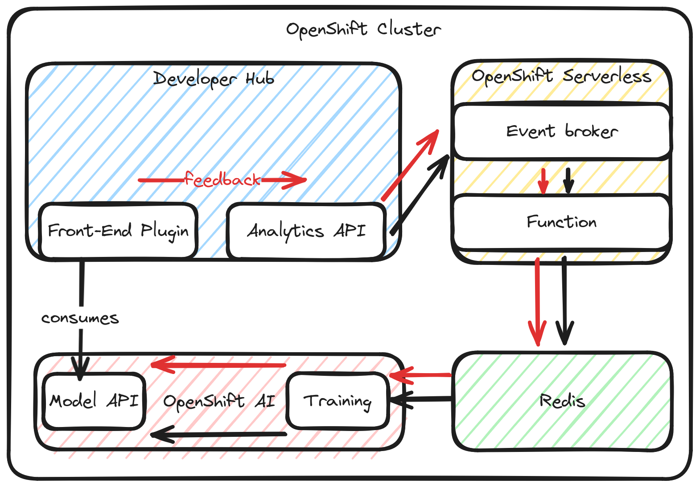

# Red Hat Developer Hub x OpenShift AI Demo

## Abstract

This project aims to enhance the user experience of internal developer portals by implementing an AI-powered recommendation engine in Red Hat Developer Hub. The engine takes into account the user's team membership, role, and behavior to provide personalized recommendations, making it easier for users to find relevant resources efficiently.

## Problem Statement

When adopting internal developer portals and thus implementing self-service and automation in an enterprise, the number of options can feel overwhelming for end-users. They need to be able to efficiently find resources that are relevant to what they are doing. The vast array of available resources and the lack of personalization can lead to a suboptimal user experience, reduced productivity, and underutilization of the developer portal's capabilities.

## Proposed Solution

To address this issue, we propose an AI-powered recommendation engine that takes the user's team membership, role, and behavior into account. By leveraging user-specific data and machine learning techniques, the recommendation engine can provide personalized suggestions, guiding users to the most relevant resources based on their context and past interactions.

### Overview

The proposed solution consists of the following components:

- Generic analytics plugin for Backstage: A custom plugin that captures user events and associated metadata within the developer portal.
- Data ingestion and transformation: A microservice that serves as the event sink, transforming and writing the events to a Redis database.
- Self-contained system with local model: The recommendation engine is designed as a self-contained system, utilizing a local machine learning model for generating recommendations.
- OpenShift AI: The processing of user data and generation of recommendations is handled by OpenShift AI, leveraging its capabilities for scalable and efficient computation.
- Backstage frontend plugin for displaying recommendations: A plugin that seamlessly integrates with the developer portal's frontend, presenting personalized recommendations to the user.
- Reinforcement mechanism: A feedback loop that allows users to provide thumbs up/down ratings and comments on the recommendations, enabling continuous improvement of the recommendation model.

### Data Capture

A custom Backstage plugin is developed to record user events and associated metadata within the developer portal. This plugin captures relevant user interactions, such as resource views, searches, and interactions with specific features. The captured data forms the basis for generating personalized recommendations.

### Data Generation

To simulate realistic user behavior and generate a diverse dataset, Selenium IDE is used to record a library of user actions. These actions are executed in random combinations to generate user events, which are captured by the Backstage plugin, providing a rich dataset for training the recommendation model.

### Data Ingestion and Transformation

A dedicated microservice acts as the event sink, receiving the captured user events from the Backstage plugin. This microservice is responsible for transforming the raw event data into a suitable format and writing it to a Redis database for efficient storage and retrieval.

### Processing

OpenShift AI is utilized for processing the user data and generating recommendations. The self-contained system with a local model leverages the scalability and computational power of OpenShift AI to train the recommendation model and generate personalized suggestions based on the ingested user data.

### Display Recommendations

A Backstage frontend plugin is developed to seamlessly integrate the recommendation engine with the developer portal's user interface. This plugin retrieves the personalized recommendations from the recommendation engine and presents them to the user in a user-friendly manner. The recommendations are displayed as "You might also be interested in X," providing users with relevant suggestions based on their context and past interactions.

### Reinforcement

To continuously improve the accuracy and relevance of the recommendations, a reinforcement mechanism is implemented. The Backstage frontend plugin includes a feedback system where users can provide thumbs up/down ratings and comments on the presented recommendations. This feedback is captured and fed back into the recommendation engine, allowing it to learn from user preferences and adjust the model accordingly.
